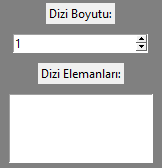
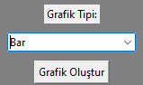
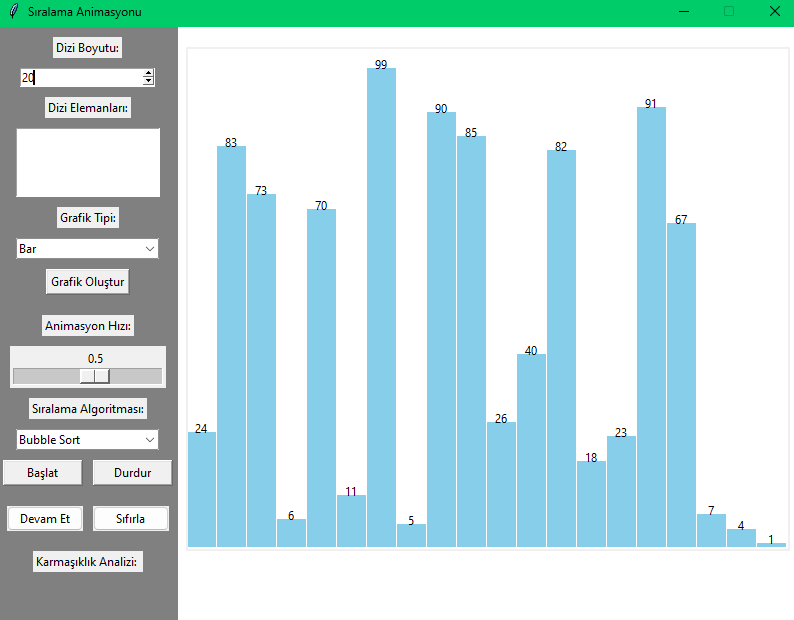
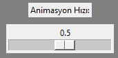
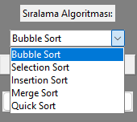
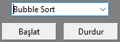
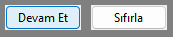
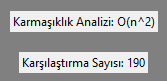
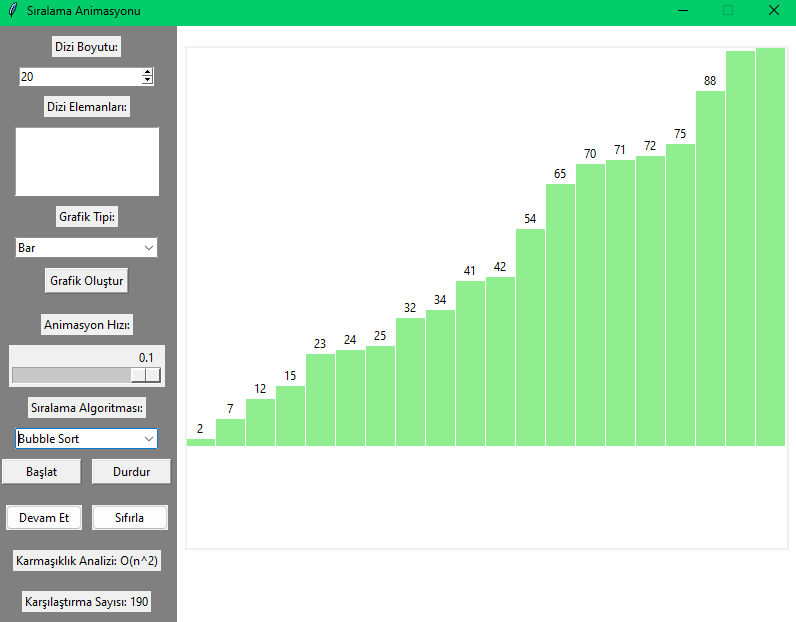

# Python Sorting Algorithm Visualizer
<a name="readme-top"></a>

<!-- PROJECT LOGO -->
<br />
<div align="center">
  <a href="#readme-top">
    
  </a>
</div>

<!-- TABLE OF CONTENTS -->
<details>
  <summary>Table of Contents</summary>
  <ol>
    <li>
      <a href="#about-the-project">About The Project</a>
      <ul>
        <li><a href="#built-with">Built With</a></li>
        <li><a href="#installments">Installments</a></li>
      </ul>
    </li>
    <li><a href="#usage">Usage</a></li>
    <li><a href="#contributing">Contributing</a></li>
    <li><a href="#license">License</a></li>
    <li><a href="#contact">Contact</a></li>
  </ol>
</details>

<!-- ABOUT THE PROJECT -->
## About The Project


This is a mandatory project of a Software Developing Laboratory-II class.

We are trying to do a sorting algorithm visualizer that contains five popular sorting algorithms which are bubble sort, selection sort, insertion sort, merge sort and quick sort. Users can enter the array manually or they can enter the number of array element and our program creates a random array. Also users can see the array with bar, scatter and stem charts.

<p align="right">(<a href="#readme-top">back to top</a>)</p>

### Built With

These are what we used to develop our program:

* Python
* PyCharm IDE

<p align="right">(<a href="#readme-top">back to top</a>)</p>

### Installments

* You need to install tkinter use this program.

```sh
   pip install tkinter
```   
  
<!-- USAGE EXAMPLES -->
## Usage

* User enters array elements by manually or just chooses a number of elements and our program selects random numbers.




* Next user chooses graph type if they want to see array in the graphs.




* Then user clicks "Grafik Oluştur" button and can see the graph.




* After that user can select the animation speed with slider.




* Later that user can select the sorting algorithm in the combo box.




* When user clicks "Başlat" button the animatons starts and if user presses "Durdur" button animation stops.




* User can continue with "Devam Et" button or reset with "Sıfırla" button.




* Also user can see the algorithms complexity and comparison numbers.




* And that is how it looks when array are sorted in bar graph.



<p align="right">(<a href="#readme-top">back to top</a>)</p>

<!-- CONTRIBUTING -->
## Contributing

The contributors of our project team:

1. Can Ata Tekirdağlı: [https://github.com/canatatekirdagli](https://github.com/canatatekirdagli)
2. Tuba Pınar Alataş: [https://github.com/pinaralatas](https://github.com/pinaralatas)
3. Kartal Yağız Deveci: [https://github.com/KartalYagizDeveci](https://github.com/KartalYagizDeveci)

<p align="right">(<a href="#readme-top">back to top</a>)</p>

<!-- LICENSE -->
## License

Distributed under the MIT License. See `LICENSE.txt` for more information.

<p align="right">(<a href="#readme-top">back to top</a>)</p>

<!-- CONTACT -->
## Contact

Project Link: [https://github.com/canatatekirdagli/Python-Sorting-Algorithm-Visualizer](https://github.com/canatatekirdagli/Python-Sorting-Algorithm-Visualizer)

<p align="right">(<a href="#readme-top">back to top</a>)</p>
